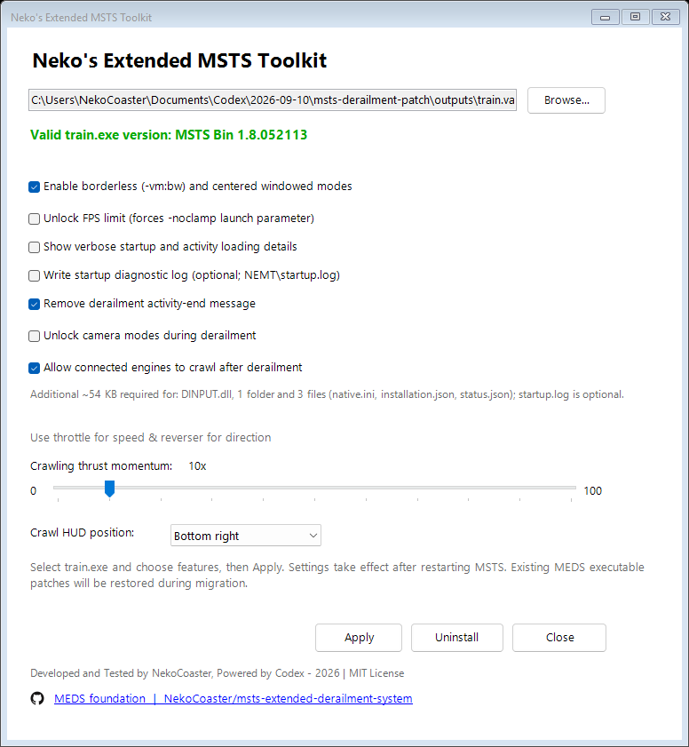

# Neko's Extended MSTS Toolkit — NEMT

A small native toolkit for Microsoft Train Simulator. Activity-end prevention, camera access and connected-engine crawling share one configurable `DINPUT.dll`.

Version **1.0.0**. Development and instrumented testing take place in a Windows VM; host testing covers the real-machine graphics setup. Exact evidence and remaining checks are documented alongside each feature.

Source: [NekoCoaster/extended-msts-toolkit](https://github.com/NekoCoaster/extended-msts-toolkit).

## Install or migrate

1. Close MSTS and extract the whole package.
2. Open **NEMT.vbs**, or drag your `train.exe` onto it. Registry detection and Browse remain available.
3. Select features and click **Apply**. Check Enable borderless for a borderless window, or uncheck it for a normal frame. Existing `-vm:w` shortcuts work in either case; launches without display arguments default to windowed. Use `-vm:WIDTH,HEIGHT,32` for fullscreen.

Supports the identified MSTS Bin **1.8.052113** base, widescreen, LAA and widescreen + LAA images. Exact image checks reject other modifications.

The installer leaves `train.exe` unchanged. Restore previously patched executables with their original patcher before installing NEMT. Supported widescreen/LAA variants are preserved. Features are configured through settings; gameplay changes apply to process memory after the driving scene becomes ready. The window module initializes during normal startup.

The installer upgrades only an owned, hash-matching `DINPUT.dll`. Existing dgVoodoo graphics DLLs and configuration are left alone. There is no Frida, Python, network listener or separate helper required during play.



## Settings

`NEMT/settings.ini`:

```ini
[Startup]
VerboseLoading=false
WriteLog=false
UnlockFPS=false
MaxLogSizeKB=8192
MaxBackupLogs=0

[Window]
Enabled=true
CenterWindowed=true

[Derailment]
PreventActivityEnd=true
UnlockCameras=true
EnableCrawl=true
CrawlStrength=10

[Diagnostics]
WriteStatusJson=false
ShowCrawlHUD=true
CrawlHUDAnchor=BottomLeft
```

Settings take effect after restarting MSTS. Crawling requires `PreventActivityEnd=true`; the form enforces this. Invalid manual configuration prevents feature installation. Missing feature flags default off. Thrust ranges from 0–100×; zero disables added thrust while retaining the selected throttle-dependent collision/animation effects.

Use **Uninstall** to remove the owned DLL and configuration. The executable remains unchanged. Ownership records and diagnostic files are retained.

## Documentation

- [Native architecture](docs/native-runtime.md)
- [Installed files](docs/installed-files.md)
- [Current validation and limits](docs/release-1.0.0.md)
- [Historical migration validation](docs/release-validation.md)
- [Borderless launch guide and implementation](docs/borderless.md)
- [dgVoodoo borderless settings](docs/dgvoodoo.md)
- [Inherited physics equations](docs/physics.md) and [identified patch locations](docs/patches.md)
- [Research history](docs/discovery.md)
- [Widescreen and in-game options investigation](docs/future-features.md)
- [FPS: prefer the existing -noclamp option](docs/miscellaneous/fps.md)

Developed and Tested by NekoCoaster, Powered by Codex — 2026 | [MIT License](LICENSE). See [third-party notices](THIRD-PARTY.md).

NEMT now checks supported text route track databases for missing section definitions before startup. [Dependency checks and limits](docs/track-dependencies.md) explains the Xtracks warning and what it can detect.

Earlier development NEMT configuration is not supported: reapply this package with the desired selections. It writes `settings.ini`; older configuration files are not read. The old `-vm:bw` spelling is no longer supported.

Ready-to-use ZIP packages and versioned changelogs are available on the [Releases page](https://github.com/NekoCoaster/extended-msts-toolkit/releases). Maintainers publish a version by pushing a matching `vVERSION` tag; the release workflow verifies committed checksums and attaches the packaged ZIP and its checksum. Existing releases are never overwritten by a rerun.
