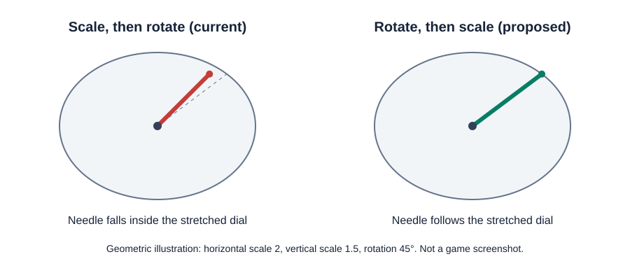

# In-game settings and cab needles — 2026-09-12

This investigation used the supported MSTS Bin 1.8.052113 image, the installed GUI definitions and the stock Acela cab. Development took place in the VM. The findings below are static code analysis and independent geometry tests, not a completed live cab correction. No Frida was attached and the installed simulator executable was not changed.

The supplied Noli widescreen patch was run on an isolated workspace copy. Its output SHA-256 was `1b041ecf4b2d2a7306218efa1d7418fd87dc21dc4b2d00056cb5749084fe55a4`, exactly matching the already-supported widescreen fixture. The original patch script, game files and decompiler exports remain local-only.

## General Options is made of real widgets

Scope update: in-game settings integration has been dropped to avoid conflicts with widget/layout add-ons. The findings below are archived technical research. The standalone form remains the settings interface.

`GUI/WIDGETS/optwidg.dat` defines the General Options checkboxes as `TrGUI_OnOff` widgets containing buttons and regions. Labels are separate text regions; checkbox surfaces come from the shared bitmap definitions. For example, the derailment checkbox occupies a 20×20 region at (94,242) in the 800×600 menu coordinate space. It is not baked into the background artwork.

The native interface has a concrete lifecycle:

| Address | Observed role |
|---|---|
| `0x462b63` | Options initialization; resolves named widgets and prepares page groups. |
| `0x463003` | Copies General Options values into checkbox widgets. |
| `0x463824` | Options event handling, tab transitions and reset behavior. |
| `0x46434f` | Applies options, calling the per-page readers. |
| `0x4643f5` | Reads General Options checkboxes back into game settings. |
| `0x44d297` | Resolves a named GUI object to its object identifier. |

The checkbox setter dispatches method `0x5a`; the getter uses `0x5b`. For the derailment checkbox, the existing game value is at `0x7b7094`. These observations establish how native settings are connected; that game value must not be repurposed for NEMT.

### Proposed integration

Add a compact NEMT entry on General Options opening a dedicated native widget group. A separate group avoids squeezing every option into the existing two columns. Generate or load NEMT-owned widget definitions through the GUI loader, retaining the installed artwork and existing controls. The first prototype should prove creation, visibility, input and cleanup with one temporary checkbox before binding all settings.

Treat changes as pending until Apply. Cancel must discard them, and resetting MSTS defaults must not accidentally erase toolkit preferences. Save the same validated `settings.ini` fields used by the standalone form, through an atomic replacement. Preserve unrelated settings and show a clear restart-required message. Do not uninstall detours from inside an active GUI callback.

The standalone form currently restores several selections from `installation.json`. Before introducing an in-game writer, that must change so `settings.ini` is the authoritative source for both interfaces; the JSON record should remain ownership metadata. Otherwise reopening the installer could overwrite settings saved inside MSTS.

Widget creation, page hiding/teardown, focus navigation, rollback on save failure and menu/activity transitions still need live validation. There is no shipping in-game options implementation yet.

## The needle transform order is wrong for unequal scaling

The cab-control path is now identified:

| Address | Observed role |
|---|---|
| `0x410712` | Registers the cab-control object methods. |
| `0x4109e0` | Creates/parses a cab-control object; branches to the dial parser. |
| `0x41192a` | Reads dial properties, including pivot and scale positions. |
| `0x41e196` | Converts the current instrument value into a rotation angle. |
| `0x41b698` | Submits textured controls; its dial branch calls the renderer at `0x41b76c`. |
| `0x44fe01` | Prepares and submits the textured quad. |
| `0x44dd35` | Builds the rotated quad around the needle pivot. |
| `0x450e3e` | Rotates an XY vector and returns its pointer; callee removes the four-byte angle argument. |

In simulation mode, `0x44dd35` multiplies the rectangle's X and width by the horizontal scale at `0x79ca68`, and Y and height by the vertical scale at `0x79ca6c`. It scales the pivot vertically, constructs four offsets around the pivot, then rotates each already-scaled offset. The calls are at `0x44de2c`, `0x44de88`, `0x44dee1` and `0x44df3c`.

The render-setup routine at `0x5210f9` writes those scale factors. The important condition is whether the two factors differ, rather than a hard-coded screen resolution.

For a point relative to the pivot, let `S` be the screen scaling and `R` the needle rotation:

```text
Current order:   R × S × point
Desired order:  S × R × point
```

Equal scaling commutes with rotation; unequal scaling generally does not. This explains why a 4:3 configuration can look correct while a stretched widescreen cab shows a needle changing shape or missing the corresponding tick marks. It is a geometry problem in the identified draw path; the widescreen binary patch itself does not add a texture-upload stretch operation.



### A focused correction

Update: an opt-in native prototype is now available in `1.1.0-alpha.1`; see the [host test guide](cab-host-test.md). It replaces the persistent scope proposed below with direct verification of the original frame chain. Live visual validation remains pending.

The existing caller already computes the scaled pivot and applies its final pixel offset. Preserve those calculations. Around the original vector rotation, convert the offset back to cab coordinates, rotate, then restore screen coordinates:

```text
corrected_offset = S × R × inverse(S) × already_scaled_offset
```

A prospective native implementation can scope this to the dial submission at `0x41b76c`, then redirect the four identified vector-rotation calls while that submission is active. It should retain the original trigonometric helper, vertex layout, texture coordinates, pivot and final pixel offset. It must bypass the correction outside simulation mode and for invalid/zero scale factors. The current routine only handles the single-quad case; larger segmented textures require a separate decision.

Do not patch the shared rotation helper globally: other interface rendering may use it. All call-site changes must use NEMT's checked mutation transaction, with verified calling conventions and cleanup. The scope state must belong to the rendering thread and unwind correctly. This proposal has not been installed in a live game.

### Independent geometry checks

`tests/cab-transform.c` checks the proposed wrapper against independently rotating the unscaled points and then scaling them. It covers 4,350 cases: six scale pairs, four corners plus the pivot, and angles from −360° to 360° in 5° steps. Equal-scale behavior, zero-angle behavior and the fixed pivot are checked explicitly.

The Acela CVF defines a 9×65 speedometer needle with pivot 44. With scale factors 2 and 1.5, a 45° example puts its top-centre point at approximately (46.669, −46.669) with the current order and (62.225, −46.669) with the screen-relative order, relative to the pivot. The roughly 15.6-pixel horizontal difference is calculated, not measured from a screenshot.

### Remaining live checks

Host feedback for `1.1.0-alpha.1` reports that the needles look substantially better. This is a positive visual comparison, not confirmation of every cab, resolution or texture variant listed below.

Use the confirmed widescreen fixture at 1280×720 and 1920×1080, plus a 4:3 control case. Start normally and wait until the driving scene and settings have loaded before any Frida attachment. Compare stock Acela speed and pressure needles through their sweeps, including neutral angles, endpoints, day/night textures and resolution changes. Check needle pivots and instrument hit regions. Also test a second cab and a cab already adapted manually for widescreen before considering a default-on correction.

The recommended next implementation is the narrowly scoped dial prototype, followed by the native settings page. Neither belongs in a production release until those checks pass.
