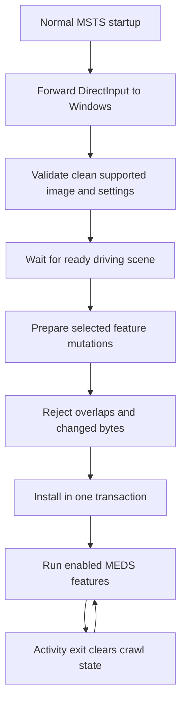

# Native toolkit foundation

NEMT derives from MEDS commit `1b7760f`. One x86 `DINPUT.dll` forwards seven DirectInput exports to the Windows system DLL and owns native feature initialization. `DllMain` does not install gameplay hooks.

## Configuration and stages

`runtime/config.h` reads restart-only feature flags from `NEMT/settings.ini`. Missing feature flags default off. Invalid booleans, invalid strength or crawling without activity-end prevention reject feature installation. `runtime/loader.c` verifies the normalized whole executable and requires the two legacy MEDS patches to be absent on disk.

The current gameplay stage waits for a stable train/head/body backlink, valid controls and an advancing simulation clock across about five seconds. Startup menus therefore remain unmodified. Settings load normally. This delay also means features are not available in the first moments of an activity. Initially paused activities wait for resume.

The [window module](borderless.md) uses a separate early command-line stage and leaves the gameplay readiness gate intact. No early Frida attachment is used.

## One mutation transaction

`runtime/hooks.h` supports checked detours and short raw instruction replacements. Every selected mutation claims an address range in a registry shared across window and gameplay stages. Overlaps and unexpected original bytes are rejected before installation. Peer threads are temporarily suspended; if a thread is inside a target prefix, installation retries. A later byte mismatch rolls back earlier writes. DirectInput forwarding continues if feature setup fails.

The optional activity-end and camera replacements use their verified MEDS bytes, now in process memory only. Crawling contributes eleven native detours, preserving registers, flags, floating-point state and call cleanup. Inactive/paused fast gates avoid full callback overhead. Raw replacements have no per-frame callback cost.



The activity-end and camera instructions remain configured until process exit. Crawl eligibility is cleared on activity exit and recovered for a later activity. The DLL never saves its in-memory patches back to `train.exe`.

## Installer ownership

The form supports drag-and-drop, registry discovery, executable verification and Uninstall. It saves feature flags without writing executable instructions. Previously patched executables must be restored with their original patcher first. Only the current NEMT ownership record is recognized. Unrelated wrappers and unknown folders are not replaced. Rollback snapshots cover configuration, ownership records and the DLL.

## Build

Use the x86 Tiny C Compiler 0.9.27 distribution:

```powershell
python runtime/build.py C:/Tools/tcc/tcc.exe
python tools/package.py
```

The build refreshes the DLL integrity hash. The packager excludes Git metadata and scratch work, verifies local documentation links and checks archive CRC/content equality. Compiler/runtime notices remain under `docs/licenses`. Contributor tools are not end-user dependencies.

## Loading and HUD modules

The independent startup module now tracks activity loading and native terrain progress; see [loading details](startup.md). The optional [white F5 HUD](crawl-hud.md) is installed during early initialization but reads crawl state only after the existing lock is ready. It uses the native renderer and adds no worker or file output. These modules use the shared checked mutation transaction, retaining whole-image validation.

A read-only [track dependency preflight](track-dependencies.md) runs before the loading hooks, outside DllMain. It uses bounded text parsing and exits with a specific dialog only for a supported database containing unresolved section references.
