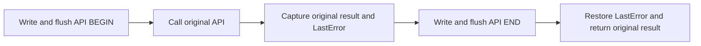

# Deep troubleshooting logging

Enabled by `[Startup] WriteLog=true`, with the existing startup.log family and bounded rotation. Missing/false leaves the four additional import slots untouched and installs no exception observer. File/display hooks remain independently available for verbose loading.

## Observed boundary and implementation

The original log stopped at the menu and did not flush every record explicitly. Its last file could describe successful unrelated work rather than the failing operation. The new logger keeps the handle, reactivates file recording during activity loading even when verbose display is off, and writes local timestamps, thread IDs and paired operations. Each record is written synchronously and flushed before returning. Local time can move when the clock changes; API durations use GetTickCount differences instead.

Four import cells are identified in both supported EXEs: DirectSoundCreate ordinal 1 at `0x84d9a8`, DirectDrawCreateEx at `0x84d944`, LoadLibraryA at `0x84db68`, and MessageBoxA at `0x84de90`. Original loader-resolved pointers are captured and chained; the shared mutation transaction owns and validates each cell before writing. Installation occurs at the verified command-line stage outside DllMain, only after supported-image and valid-configuration checks. No EXE or graphics wrapper is rewritten.

The logger observes calls made through these game imports, not every call made privately within graphics/audio DLLs or every COM method. DirectDraw creation is not evidence that later rendering-device creation succeeded. Display enumeration is not proof of the selected GPU. DirectSound/DirectDraw HRESULTs identify API results; Win32 LastError may be stale after successful calls.

A vectored observer records at most eight selected first-chance access-violation, illegal-instruction, integer-divide and privileged-instruction exceptions. It always returns CONTINUE_SEARCH, never replaces the game's unhandled-exception handler, and uses a nonblocking attempt to acquire the logging lock. It does not perform stack walking or claim that an observed exception was fatal. Other threads may still be writing, so no crash-time guarantee is possible. Stack overflow and arbitrary corruption cannot be safely recovered by logging.

## Validation

`tests/deep-log.c` exercises production wrappers, return/output/LastError preservation, timestamp shape, single-line sanitization, logging without verbose display, repeated loading boundaries, exception pass-through and shared transaction overlap rejection. `tests/deep-sites.py` checks import identities in base and widescreen fixtures. `tests/deep-crash.c` uses a disposable child process to check retained log tails after abrupt termination and an observed exception followed by termination, without normal logger cleanup. Existing size/retention, startup, mutation and driving-readiness checks remain relevant.

These are isolated regression checks, not an Acer laptop crash reproduction. No CPU scheduling, GPU preference, dgVoodoo configuration or audio fallback is changed. The laptop capture is intended to establish evidence before selecting a compatibility workaround. Crashes before NEMT's verified bootstrap or failed log creation can leave no new log.

## Hybrid-core investigation

Windows exposes CPU topology through [GetSystemCpuSetInformation](https://learn.microsoft.com/en-us/windows/win32/api/processthreadsapi/nf-processthreadsapi-getsystemcpusetinformation). [CPU Sets](https://learn.microsoft.com/en-us/windows/win32/procthread/cpu-sets) provide soft affinity, while [SetProcessAffinityMask](https://learn.microsoft.com/en-us/windows/win32/api/winbase/nf-winbase-setprocessaffinitymask) restricts eligible processors. A future P-core experiment must discover topology, respect existing restrictions and processor groups, and remain optional; hard-coded processor-number assumptions are unsuitable. This logger does not implement that experiment or establish hybrid cores as a crash cause.
