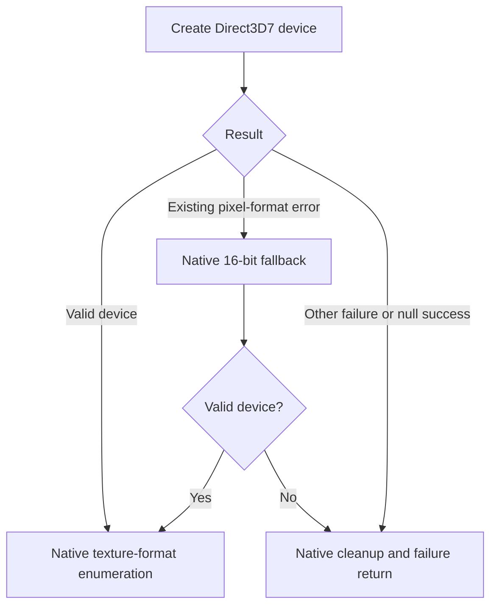

# Direct3D initialization failure handling

## Laptop evidence

A user-supplied Acer Helios 16 log (RTX 4080 Laptop GPU, i9-14900HX; 2026-09-14) showed successful DirectSoundCreate and DirectDrawCreateEx calls, followed by access violation `0xc0000005` at `train.exe+0x3062cb`. DDRAW loaded from Windows System32, consistent with the user's test without dgVoodoo. This is user-provided evidence, not a local reproduction of that hardware failure.

Static inspection located the fault in native Direct3D7 device probing. At `0x7061c8`, MSTS creates a device. It handles one pixel-format error with its existing 16-bit surface fallback, but the branch at `0x7061dd` incorrectly lets other errors reach texture-format enumeration. The faulting instruction dereferences the device pointer before that enumeration. The log did not contain the original Direct3D HRESULT or pointer value, so failed creation followed by a null pointer was the leading explanation, not a measured return value.

## Delivered safeguard

The repair redirects nonzero errors other than the existing pixel-format fallback to native cleanup at `0x7062e8`. Both creation calls (`0x7061c8`, `0x7062b4`) go through a checked wrapper. It preserves arguments, outputs, return values and LastError, except that success with no returned device becomes E_FAIL. Deep logging records the requested device GUID, surface, HRESULT, pointer and duration. It does not invent a device, change dgVoodoo, or force software rendering.

All three verified ranges belong to the shared mutation transaction. The two five-byte call replacements include the original comparison, so their generated stdcall bridge explicitly restores CMP EAX,ESI flags before returning and removes the original four arguments. Stub memory becomes executable only after emission. Installation occurs after supported-image/config validation during the command-line bootstrap; game executable bytes stay unchanged. The safeguard is part of an installed NEMT runtime, independent of whether deep logging is selected.

`tests/device-init.c` loads the original probe from both local supported EXE fixtures and executes it with fake COM objects. It checks success, general failures, null-success, the pixel-format fallback, enumeration failure and cleanup. This executes the patched bridge and original branch logic, rather than merely testing a rewritten model. No extracted game code is distributed. A missing usable rendering device can still prevent startup; avoiding the invalid dereference is not a guarantee that native rendering will work on every GPU.

## OS version reporting

An unchecked Compatibility tab does not exclude automatic compatibility treatment. The laptop reported Windows 5.1 build 2600 to the version API. The log now calls this **OS APPLICATION VIEW**, and separately records build/display-version/product-name metadata from the 64-bit Windows registry view. These sources may disagree; registry product names can also be historical. Neither alone proves which compatibility shim is active, and the toolkit does not remove shims or alter compatibility settings.

## Follow-up: invalid object and silent exit

The laptop follow-up reported `CreateDevice = 0x88760082` (`DDERR_INVALIDOBJECT`) with a null output device, after successful DirectSound and DirectDraw creation. The user observed a black window followed by a silent exit. The earlier access violation was absent, consistent with the guard reaching native failure handling; this is not proof of a clean process exit. The P-core preference was accepted for 16 CPU Sets in this run but did not prevent graphics failure.

Deep logging now captures all three CreateSurface call sites within this probe: `0x70610b`, `0x70625e`, and `0x70629a`. Each five-byte CALL/CMP range is validated and claimed in the same transaction as the existing device guard. The bridge preserves stdcall cleanup and CMP flags. Request descriptors, returned pointers, HRESULTs and durations are recorded. Before device creation, GetSurfaceDesc records actual dimensions, caps and pixel format; GetDDInterface records the owner and releases the acquired reference. Different interface addresses alone do not prove different COM objects. Descriptor fields must be interpreted using their flags.

These extra COM queries run only with deep logging enabled. They do not modify or restore a surface, change device selection, or force the pixel-format fallback. BEGIN records are flushed before the queries, so an interrupted query is identifiable. As with any in-process diagnostic, a defective COM implementation can still fault during inspection.

A once-per-process warning reports a non-pixel-format device creation failure even with logging disabled. It says MSTS will continue normal error handling rather than claiming that every failed probe is fatal. Pixel-format failures remain silent to allow the existing retry. No artificial success result is returned.

The exact cause of INVALIDOBJECT remains unresolved. Candidates include the surface/object setup, native legacy graphics support, and compatibility handling. It does not establish insufficient GPU capability or a CPU scheduling fault.

Validation: native probe tests on both executable fixtures cover all six hook ranges, failure and retry behavior with logging on/off, and warning suppression on successful fallback. A separate file-backed test verifies requested/actual surface records, owner reference balance, return/output/LastError preservation and one-time warning delivery. These are simulated COM tests; the new diagnostic build still needs a laptop run.

## Targeted INVALIDOBJECT probe retry

The next laptop log confirmed successful creation and inspection of a 2560x1600 32-bit primary surface; GetDDInterface returned the same interface address used for creation. Device creation still returned INVALIDOBJECT. This narrows the failure but does not prove its underlying cause.

Only the first CreateDevice call in the verified capability probe now treats INVALIDOBJECT with a null output as a request for MSTS's existing fallback. The actual HRESULT remains in the diagnostic record; `D3D PROBE RETRY` explicitly records translation to the private pixel-format branch signal. Native code releases the primary surface, creates its 16x16 off-screen RGB565 surface (with its existing RGB555 surface-creation retry), then attempts device creation once more. The second device call never performs this translation, so repeated INVALIDOBJECT follows normal failure cleanup and warning. Other errors and non-null failed outputs keep their original behavior. This is not a general replacement of Direct3D errors or a guarantee of usable gameplay rendering.

No additional instruction ranges are patched: the two already-validated call sites now use distinct bridges to distinguish the first and second attempts. Installation remains at the validated bootstrap stage. The change is active without deep logging; enable logging for laptop validation. The executable on disk is unchanged.

Regression coverage on both native fixtures includes INVALIDOBJECT followed by success, repeated INVALIDOBJECT, both fallback surface creations failing, RGB565 surface creation failing followed by RGB555 success, and INVALIDOBJECT with a non-null output (no retry). Tests check bounded attempt counts, warning behavior, and cleanup reference counts with logging on/off. Laptop validation remains pending.

The laptop user subsequently confirmed successful startup without dgVoodoo and approximately 180 FPS after the off-screen retry. Route loading, cab rendering and menus were reported working; an extended driving session remains untested. Higher-resolution selection separately required D3DIM700.DLL on that installation. These are user observations, not instrumented benchmarks.

A subsequent successful log (18:36) shows four successful device creations on the original 2560x1600 32-bit surface, no D3D PROBE RETRY, and completed startup/activity loading. Thus that run does not exercise the fallback. The user had separately reported adding D3DIM700.DLL for higher resolutions; its causal role in the changed probe outcome is not established by this log. The earlier successful user test after the retry and this later direct-success trace are distinct evidence.
