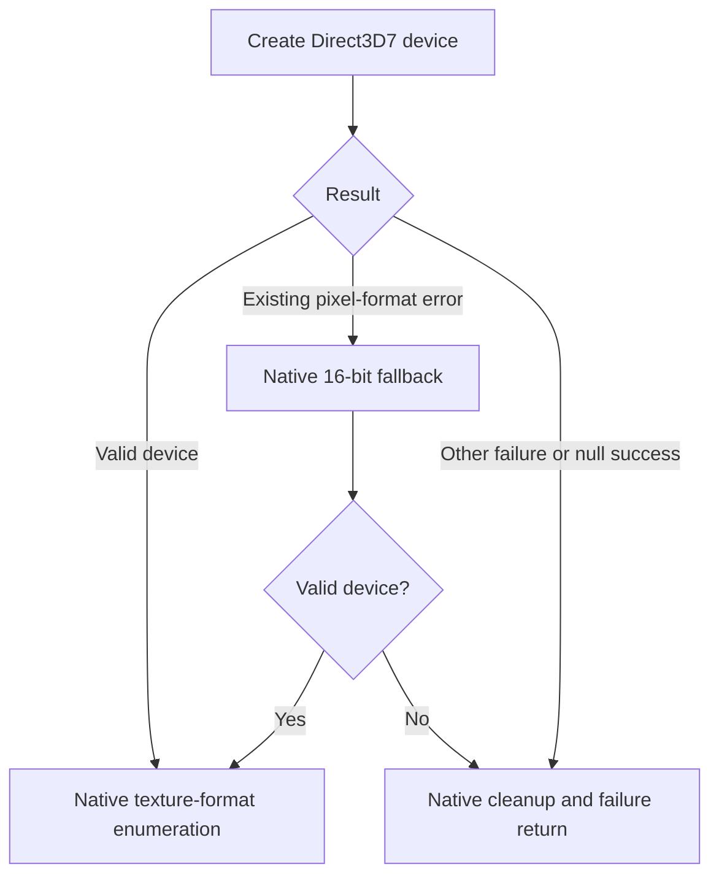

# Direct3D initialization failure handling

## Laptop evidence

A user-supplied Acer Helios 16 log (RTX 4080 Laptop GPU, i9-14900HX; 2026-09-14) showed successful DirectSoundCreate and DirectDrawCreateEx calls, followed by access violation `0xc0000005` at `train.exe+0x3062cb`. DDRAW loaded from Windows System32, consistent with the user's test without dgVoodoo. This is user-provided evidence, not a local reproduction of that hardware failure.

Static inspection located the fault in native Direct3D7 device probing. At `0x7061c8`, MSTS creates a device. It handles one pixel-format error with its existing 16-bit surface fallback, but the branch at `0x7061dd` incorrectly lets other errors reach texture-format enumeration. The faulting instruction dereferences the device pointer before that enumeration. The log did not contain the original Direct3D HRESULT or pointer value, so failed creation followed by a null pointer was the leading explanation, not a measured return value.

## Delivered safeguard

The repair redirects nonzero errors other than the existing pixel-format fallback to native cleanup at `0x7062e8`. Both creation calls (`0x7061c8`, `0x7062b4`) go through a checked wrapper. It preserves arguments, outputs, return values and LastError, except that success with no returned device becomes E_FAIL. Deep logging records the requested device GUID, surface, HRESULT, pointer and duration. It does not invent a device, change dgVoodoo, or force software rendering.

All three verified ranges belong to the shared mutation transaction. The two five-byte call replacements include the original comparison, so their generated stdcall bridge explicitly restores CMP EAX,ESI flags before returning and removes the original four arguments. Stub memory becomes executable only after emission. Installation occurs after supported-image/config validation during the command-line bootstrap; game executable bytes stay unchanged. The safeguard is part of an installed NEMT runtime, independent of whether deep logging is selected.

`tests/device-init.c` loads the original probe from both local supported EXE fixtures and executes it with fake COM objects. It checks success, general failures, null-success, the pixel-format fallback, enumeration failure and cleanup. This executes the patched bridge and original branch logic, rather than merely testing a rewritten model. No extracted game code is distributed. A missing usable rendering device can still prevent startup; avoiding the invalid dereference is not a guarantee that native rendering will work on every GPU.

## OS version reporting

An unchecked Compatibility tab does not exclude automatic compatibility treatment. The laptop reported Windows 5.1 build 2600 to the version API. The log now calls this **OS APPLICATION VIEW**, and separately records build/display-version/product-name metadata from the 64-bit Windows registry view. These sources may disagree; registry product names can also be historical. Neither alone proves which compatibility shim is active, and the toolkit does not remove shims or alter compatibility settings.
