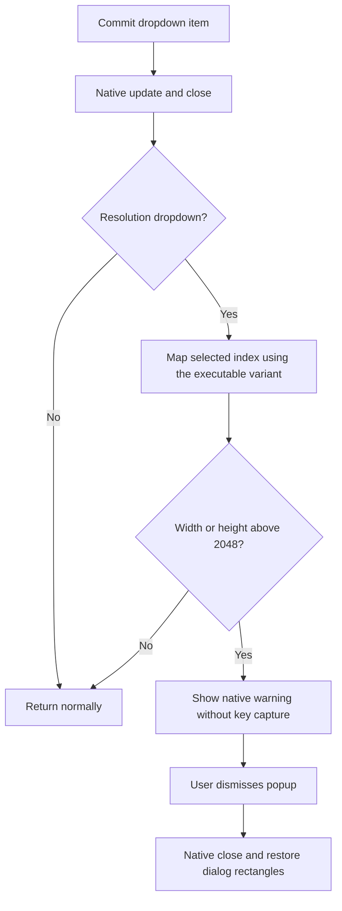

# Display guidance and refresh-rate cap

## Resolution guidance

Selecting a resolution whose width or height exceeds 2048 pixels now opens a native MSTS popup after the dropdown closes. Exactly 2048 does not trigger it. The alert tells users to close MSTS and copy `D3DIM700.DLL` from their original `msts-widescreen-patch.zip` into the folder containing `train.exe`. Without that workaround, the game may revert to 1280 x 720 or crash. The notice is informational even when the DLL is present; NEMT does not inspect its version, download it or replace graphics DLLs.

[Digital Rails](https://digital-rails.com/wordpress/2018/06/23/running-msts-at-high-resolution/) documents the greater-than-2048 limitation. User testing found resolution reversion without D3DIM700.DLL and successful higher-resolution selection with it. This is separate from NEMT's off-screen startup-probe workaround.

### Correction to the v1.1.0 implementation

The original inline note did not appear in user testing. Its synthetic test exercised a welcome-message text hook at `0x44c59c`, but the resolution dropdown uses a different dispatch path. Those tests established helper behavior, not that real selections reached it. The inline heading mutation has been removed. [Issue #2](https://github.com/NekoCoaster/extended-msts-toolkit/issues/2) tracks this correction.

The new hook replaces the final dropdown-close call at `0x43b3e4` inside the committed-item handler `0x43b1fb`. It forwards that call first, then checks that the closed popup was `combopopup9`. It reads `displayrescombo`'s selected index at offset `0x114` and maps it to the ten-entry resolution table at `0x79ca70`. The base executable skips unavailable entries; the supported widescreen patch lists all entries. Exact branch bytes at `0x4633b3` select the matching interpretation. List population and hover do not use the hooked call site.

The existing `condlgpopup` keyboard-assignment dialog supplies modal display and the dismissal button. NEMT assigns warning text and an OK label, temporarily repositions its title and body, then opens it through native method `0x58` with context `0x2b`. It does not enable key capture. The existing dismissal handler still closes the popup and clears input capture. A hook at `0x4648f2` restores the original title/body rectangles afterward. Only rectangle fields are restored: text pointers are owned by MSTS and must not be restored after its text setter replaces their allocations. Unrecognized custom dialog geometry is left untouched and receives no popup.

Both call patches use the shared mutation transaction and exact original-call validation. Installation occurs at the verified main-game bootstrap stage; toolset is excluded. Game executable and GUI files remain unchanged.

### Validation and remaining host check

`tests/resolution-alert.c` covers both index mappings, the strict threshold, other dropdowns/messages, repeated selections, reentrancy suppression, normal dismissal, rectangle restoration without stale text pointers, custom-layout exclusion and exact call signatures in both supported executable fixtures. Existing welcome/footer and refresh-pacing checks pass. These are synthetic behavior and fixture checks, not proof of native rendering.

A local visual attempt stopped at an inaccessible MSTS license dialog before reaching the menu. The temporary diagnostic DLL was removed and the installed DLL restored. Host verification remains: select a mode above 2048, confirm all warning text and OK are visible, dismiss it, choose a lower mode, then open keyboard assignment to confirm its normal appearance and input behavior. Also check selecting another high mode produces a fresh warning.

## Limit FPS to vsync

The optional checkbox shares the Unlock FPS row and is enabled when Unlock FPS is checked. Configure `[Startup] LimitToVSync=true` alongside `UnlockFPS=true`, or use `-UnlockFPS -LimitToVSync` with the patcher. Both default off. Restart after changing settings.

This is a refresh-rate frame cap, not a presentation VSync override. It does not guarantee tear-free display; driver/wrapper synchronization still applies. The native frame hook queries the monitor nearest the game window and its current refresh rate, updating approximately once per second. Unknown refresh falls back to 60 Hz. Integer refresh rates from Windows may round fractional rates. Slower rendering does not create catch-up debt.

Pacing uses a high-resolution waitable timer where available, otherwise Sleep. It does not alter global timer resolution, power plans or driver settings. Fallback timer granularity can yield a lower frame rate. Corrected simulation timing includes the wait; the existing pause/calendar decisions remain native. Editors use a separate frame loop and are unaffected.

Tests cover pacing at 60/144/240 Hz, slow frames, disable and timer-query failure; existing native timing regressions still pass. These synthetic checks do not establish tearing behavior, every monitor configuration or long-session stability.

## Deep logging selection

The checkbox reads `Enable deep logging (Optional; HIGH DISK USAGE! Use only for bug reporting or troubleshooting issues)`. Use Recommended enables the available feature checkboxes and explicitly turns deep logging off, including when it was previously enabled. The form reserves extra height for the longer label. UI checks cover the FPS row, logging reset and footer padding.

The form places Prefer P-cores first and deep logging after Extended F5 HUD Location for Crawling statistics. Its heading includes Patcher and the version. Content height is calculated with monitor bounds and a scroll fallback; the complete layout was visually checked without scrolling on the test display. The user reports approximately 222 FPS on a 240 Hz display and 56 FPS at 60 Hz with the cap, accepted for now. These observations do not establish exact synchronization or a particular cause of the undershoot.
