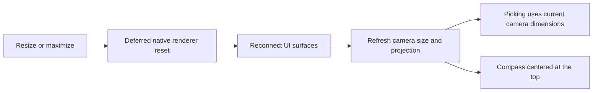
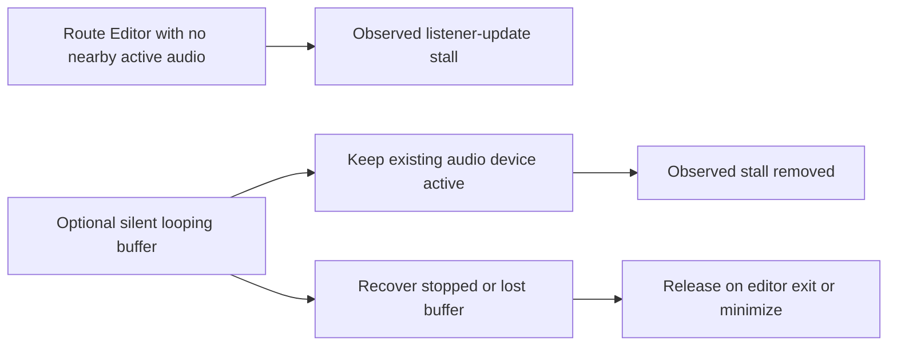
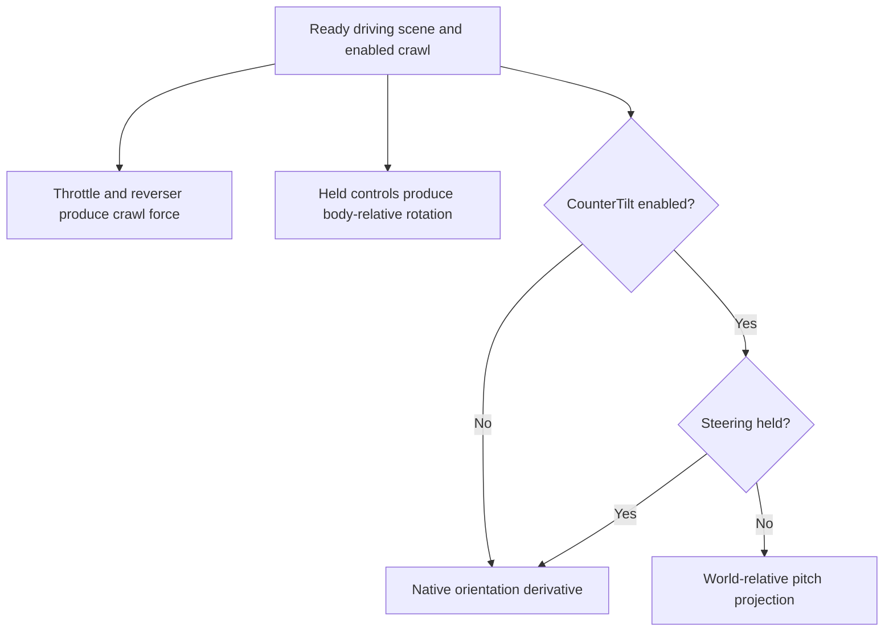

# NEMT 1.1.0: findings, fixes and validation

This release brings the editor, crawl and quality-of-life work together. The links below contain instruction locations, equations and individual regression coverage. Historical alpha notes describe their checkpoint, not necessarily the delivered implementation.

## Editor rendering and input

A larger window alone did not enlarge the rendered world. MSTS also caches renderer surfaces, camera dimensions and picking coordinates. The delivered resize path updates these together at a native frame boundary after resizing settles.

Route Editor preserves vertical field of view while showing more horizontally. The picking fix replaces 24 verified fixed-size operands; it retains native rays and hit tests. Cab Editor instead preserves its 640 by 480 logical canvas: a centered proportional fit adds white margins, and inverse mouse mapping keeps selections aligned. Cursor warps require the matching forward transform; fixing only incoming mouse coordinates caused the fullscreen snap. Activity Editor preserves map center and scale, supports wheel zoom, and folds the right and bottom panels independently when they would exceed the monitor work area. Owned tool windows remain above their editor rather than globally above other applications.

Main-game borderless handling excludes `-toolset`. Editor fullscreen is controlled by the separate editor option. Shared verbose startup/loading messages still work in toolset. See [editor implementation and checks](editors.md) and the [editor user guide](../editors.md).

## The apparent camera angle limit

The Route Editor free camera itself was not the limiting angle clamp. Its virtual pointer accumulated movement until it reached a screen-sized rectangle; subsequent coordinate differences became zero. The optional fix collects relative movement while native camera panning is active and feeds it to camera input once per frame. Focus loss, menus and button transitions clear pending motion. Ordinary pointer bounds and simulator cameras retain their native behavior.

Camera key swapping is separate: held configured keys drive translation, while buffered arrow events invoke the displaced commands. Paired press/release mappings preserve modifiers and avoid leaving a synthetic Ctrl key held. See [input and panning details](editors.md).

## MegaCoaster slowdown without nearby sound

The observed stall was in the native audio listener update. An authorized short local capture measured roughly 206 ms per call without nearby active audio. Keeping a silent looping buffer on MSTS's existing DirectSound device removed that stall on this installation. A later capture observed about 56 native frames per second, versus roughly 4–5 before the workaround. These observations are installation-specific, not a performance promise.

No sound source is inserted into a route. Removing four missing MegaCoaster model references was separately authorized local test preparation, not a shipped route modification. The buffer lifecycle, retry behavior and exact measurements are documented in [editor implementation](editors.md).

## Crawl: distinguish three independent effects

| Effect | Delivered behavior |
| --- | --- |
| Friction reduction | Remains present with crawl; throttle reduces the native friction contribution. |
| Manual rotation | Space rolls toward upright about the locomotive's length; brake release/apply steer left/right about its own up axis. Angular drag is exempted while manual rotation is held. |
| Optional counter-tilt | Defaults off. When enabled, filters throttle-dependent pitch relative to world vertical, fading near vertical. Steering temporarily bypasses it. It is not automatic leveling. |

The original filter used body right, which becomes world vertical when the locomotive lies on its side. The corrected horizontal pitch axis comes from body forward and world up. The optional filter installs three additional verified hooks; disabled configurations leave those instruction sites untouched. Manual righting/steering use their own timestep and inertia calculations, independent of this projection. See [physics and controls](physics.md), [projection math](../investigations/world-pitch.md) and the [crawl settings guide](../crawl-hud.md).

The initially ineffective controls also exposed a native keyboard-buffer size mismatch: the supported game has 238 key entries, requiring 30 bytes. Held and buffered input now share the configured derail scan code. Derail is edge-triggered and gated by driving readiness, focus, pause and menus. The four-line F5 HUD shows force, direction, engine counts and active rotation, with **Steer Left/Right** in the shortcut legend.

## Other delivered workarounds

- Widescreen cab needles use the corrected transform only on a supported widescreen executable. The panel disables that option otherwise and shows separate download and installation-guide links. NEMT does not install the widescreen patch.
- The optional startup movie skip avoids the observed movie-related keyboard issue. Earlier movie rendering experiments were retired; they are not delivered settings.
- Uncapped FPS remains explicitly marked potentially unstable. Corrected timing addresses the identified timestep issue; it cannot guarantee compatibility with every scene or wrapper.
- Red-signal continuation preserves the failure notification and resumes afterward. Background audio and diagnostic logging are independent options.
- The expanded welcome message applies to the main game. Toolset retains its own extended text.

See [cab investigation](../investigations/settings-and-cab-needles.md), [movie investigation](../investigations/startup-movie.md), [timing investigation](../investigations/unclamped-timing.md) and [red-signal investigation](../investigations/red-signal-repeat.md).

## Validation and release boundary

The development checkpoints include automated native math, input, hook-site, transaction, readiness and installer checks, plus documented local live editor/driving checks and user gameplay feedback. Optional counter-tilt restoration was checked automatically; it did not receive a new instrumented handling measurement. Host results do not establish mixed-DPI, every graphics wrapper or every vehicle/terrain combination.

The initial release-polish commit changed presentation and documentation without changing the runtime DLL. The subsequent [deep-logging addition](deep-logging.md) rebuilds the runtime and adds dedicated diagnostics regression coverage. Packaging verifies DLL integrity, relative documentation links, file hashes, archive contents and excluded private/game files. Development now uses `dev`; a pull request into `main` is the approval boundary. Preparing this version does not publish a release or create a tag.

Release-form checks instantiated the production form against base and widescreen fixtures, verified conditional help visibility and two link targets, measured text fit and 24-pixel scroll padding, and visually inspected both rendered states including the scrolled footer. No Apply operation or game file change was needed for these presentation checks.
